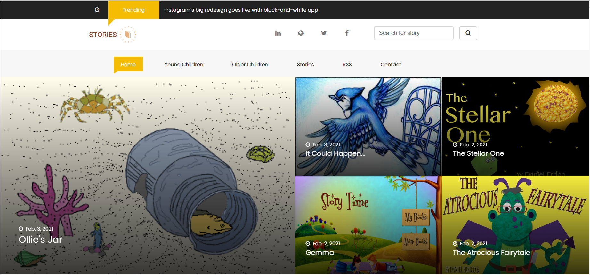
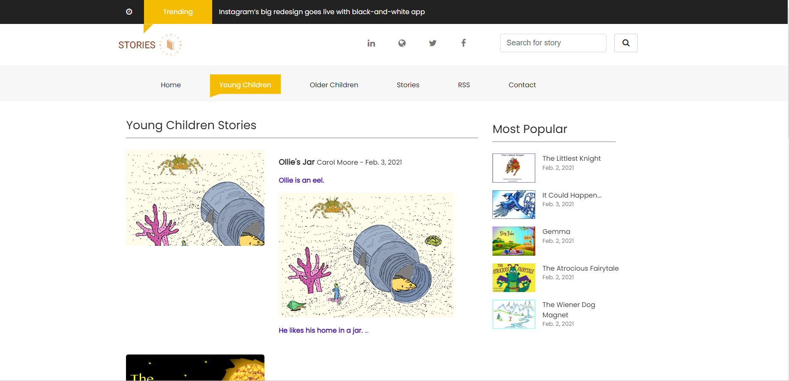

# STORIES
Django practice project strory website

# Installation
* 1 - clone repo https://github.com/ttientrung/stories.git
* 2 - create a virtual environment and activate
*  - pip install virtualenv
*  - virtualenv envname
*  - envname\scripts\activate
* 3 - cd into project 
* 4 - pip install -r requirements.txt
* 5 - python manage.py runserver

# Features
* Story
* Search
* RSS

# Knowledge
* Basic Djagno Overview
* Database Design and Models
* Static Files
* Search
* Pagination
* Deployment

# Tech Stack
* Django

# Home Page
  

# Young children Page
  
